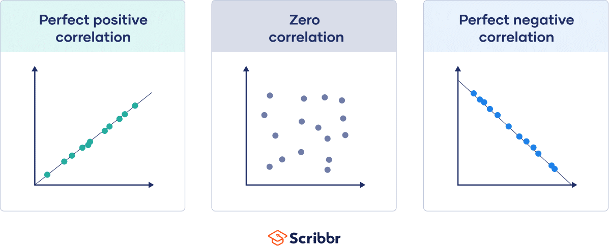

# ryx


<!-- badges: start -->
<!-- badges: end -->

The goal of ryx is to calculate correlations with r and p values between a dependent variable y and one or more independent x variables. The `print.ryx` function prints the results nicely, the `summary.ryx` function summarizes the results nicely, and the `plot.ryx` function plots the results nicely. 

## Installation

You can install the development version of ryx like this:

``` r
#install.packages("remotes")
#remotes::install_github("https://github.com/aa-crown/ryx")
```

## Example

This is a basic example which shows you how you can use the ryx package:

``` r
#library(ryx)
x <- ryx(mtcars, y="mpg", x=c("hp", "wt", "disp", "cyl", "am", "gear"))
print(x)
summary(x)
plot(x)
```

